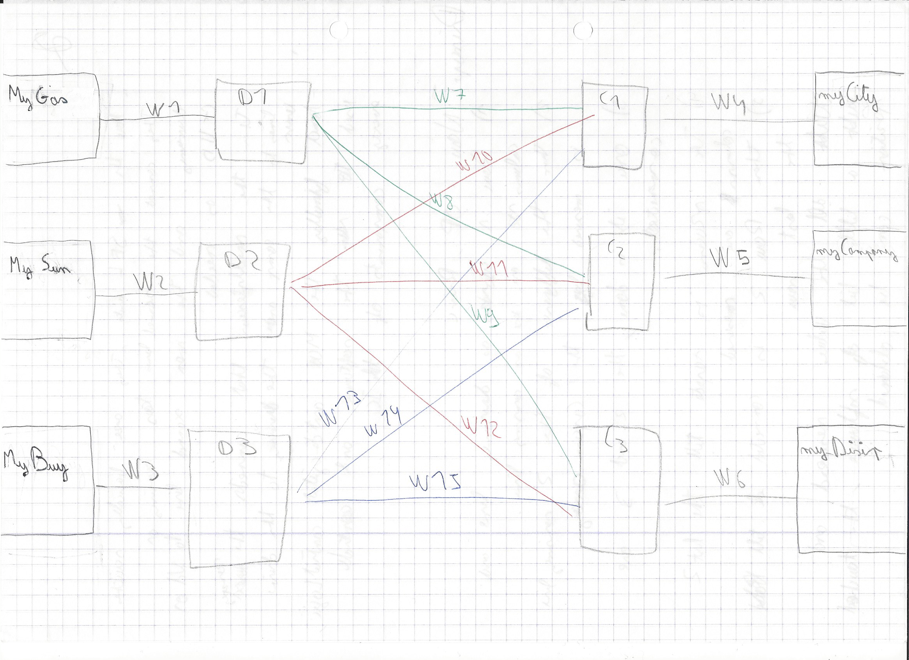
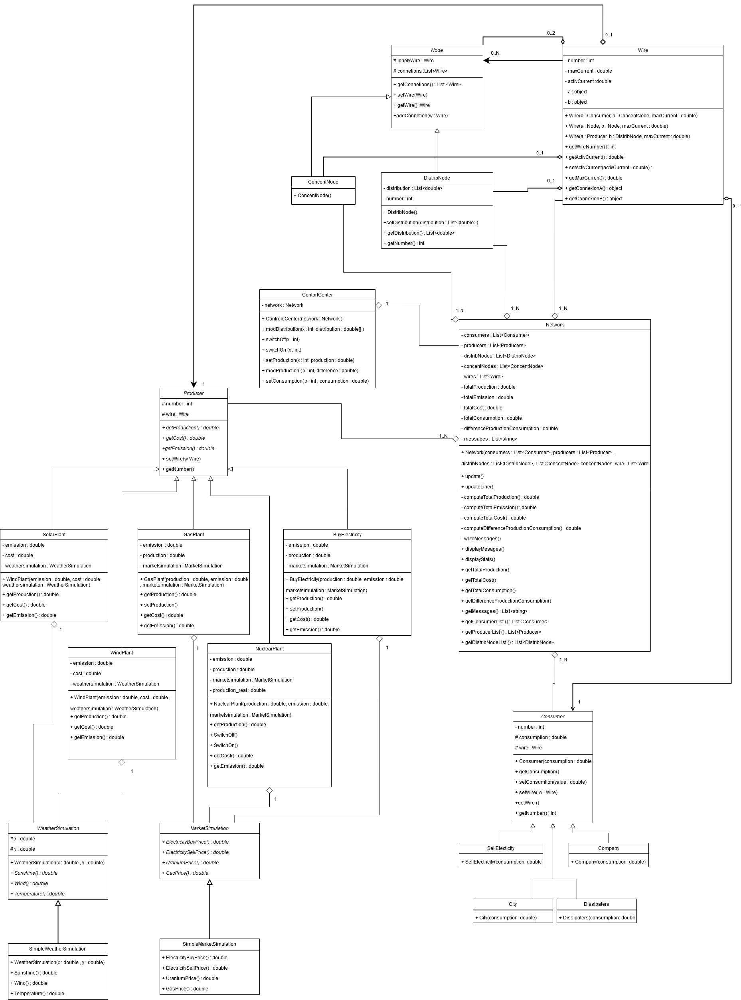
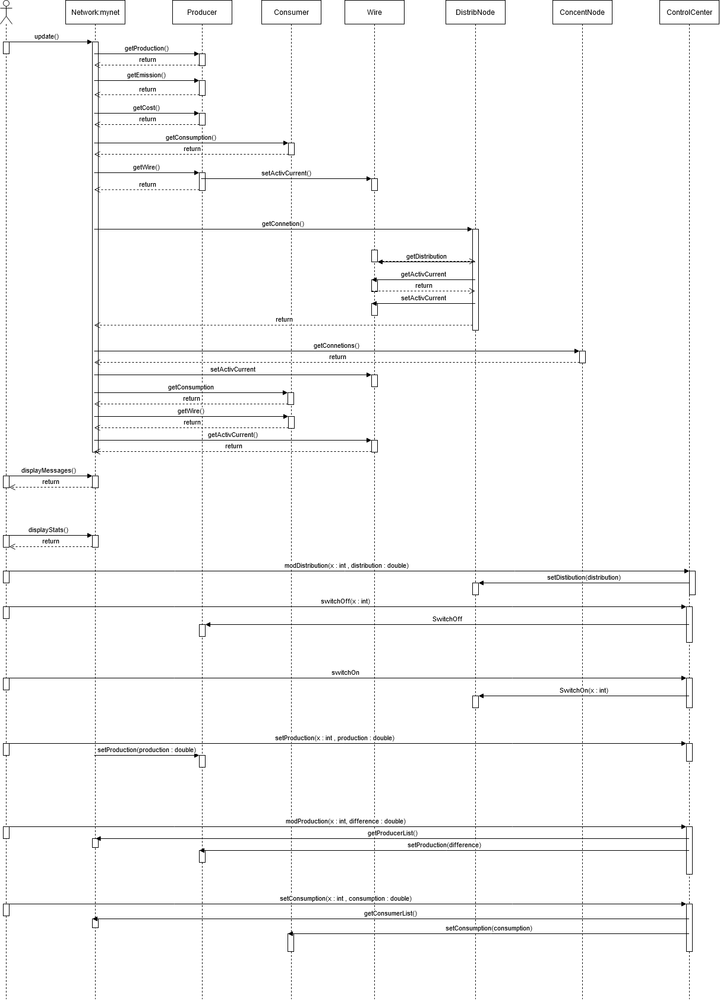

Matthias Léonard 20308

Stanislas Baudin 195344

Rapport Projet POO : Simulateur de réseaux électrique

Langage de programmation : C# 

Ce programme comporte des classes : Wire, Consumer, Producer, Node, Simulation permettant de simuler un réseau électrique et vérifier les statistiques de production et de consommation. Le programme permet de retourner une alerte en cas de courant trop élever dans un câble d’alimentation, de sous production ou de surproduction. 

Il est possible de créer des objets à partir des classes : 

Producer : 
- Centrale nucléaire 
- Centrale au gaz
- Centrale solaire 
- Centrale éolienne 
- Centrale d’achat d’électricité 

Consumer : 
- Ville
- Entreprise
- Dissipateurs
- Centrale de ventre d’électricité 

Node : 
- Noeud de distribution 
- Noeud de concentration 

Wire :
- Fils de connexion 

Simulation : 
- Marché de vente 
- Donnée météo

Pour crée un réseau et pouvoir l'ultliser, il faut :
- Instancier un marché de vente et/ou météo
- Instancier les producteurs  
- Instancier les fils 
- Instancier les noeuds 
- Instancier les consommateurs
- Instancier un réseau 
- Instancier un centre de contrôle

----------------------------------

Il faut impérativement : 

Connecter les fils des producteurs. (.setWire(Wire w))

Connecter le fil d’alimentation pour un noeud de distribution ou le fils de concentration pour un noeud de concentration via la commande : .setWire(Wire w) ;

Ajouter les autre connexions via : .addConnetion(Wire w)

Connecter les consommateurs à un fils via : .setWire (Wire w)

----------------------------------

Le constructeur du réseau prend en argument des listes de tous les éléments du réseau.

Le Réseau nous permet de :

- Mettre à jour les informations de production, de consommation, de cout, la différence entre la consommation et la production,... via la commande : .update()
- Récupérer ces donnés, avec des méthodes get

Un exemple de réseau et un exemple d'implémentation de simulation de ce réseau sont présent dans le program.cs. Cette exemple simple de simuation, augmente la production de la centrale à gaz si il manque d'énergie dans le réseau et dissipe le suprlus d'énergie dans un dissipateur. La simultation est mise à jour 3 fois avec un intervalle de une seconde entre chaque mise à jour du réseau. Le réseau exemple suit le schéma suivant : 

----------------------------------

Le constructeur du centre de contrôle prend un réseau en argument.

Le centre de contrôle nous permet de régler : 
- Les production : .setProduction(int x, double production)
- Allumer/Eteindre des centrale de production : .switchOn(int x)/ .switchOff(int x)  
- Régler les consommations : .setConsumption(int x , double consumption)
- Régler la part de distribution dans les nœuds : .modDistribution (int x , double[] distribution )

----------------------------------

Diagramme de classes :

----------------------------------

Diagramme de séquence : 

